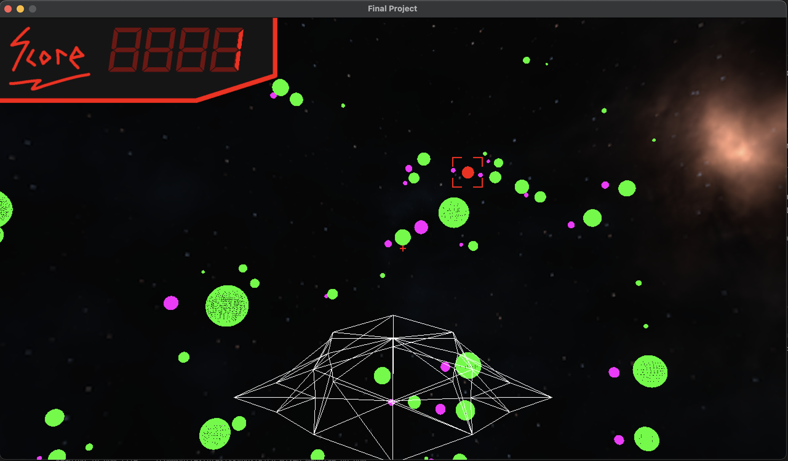

# Space Delivery Game

Welcome!

Your goal is to deliver packages to as many planets/moons as you can.
There is a marker on your screen that will point you to your destination.
Fly through the target to deliver the package and get your next assignment!
Good luck, pilot!

## Video Overview: 

**[YouTube Link](https://youtu.be/jXlYeQAppDw?si=y5UutyLX-G79w8Wl)**

## Features:
* Skybox
* Custom GUI
* 2D dynamic location marker
* Scoreboard
* Dynamic FOV for speed
* Galaxy generation

## Controls:
* [W] - Forward Thrust
* [S] - Brakes
* [Spacebar] - Overdrive (How to make the Kessel run in less than 12 parsecs!)
* [Mouse] - Look around to steer the ship
* [Esc] - Resign from the delivery service (Quit the game)

## Acknowledgements:

This project was completed as a final project for Mike Shah's Spring 2024 Computer Graphics class. Some starter code was provided by Mike Shah and attributed on a file-by-file basis. 

## Screenshots

**Start of the game view. Targeting the red planet in view**

**Looking over a large number of planets (green) and their moons (purple)**

**The Field of View (FOV) is increased as the ship is flying incredibly fast so planets look skewed and more of the galaxy is visible**

**The score increases when the ship visits the marked planet/moon (red)**

**When the marked planet is offscreen the 'X' icon shows the direction the ship must fly to reach the planet. The ship is tilted slightly as the player is currently turning to the left with the mouse**

